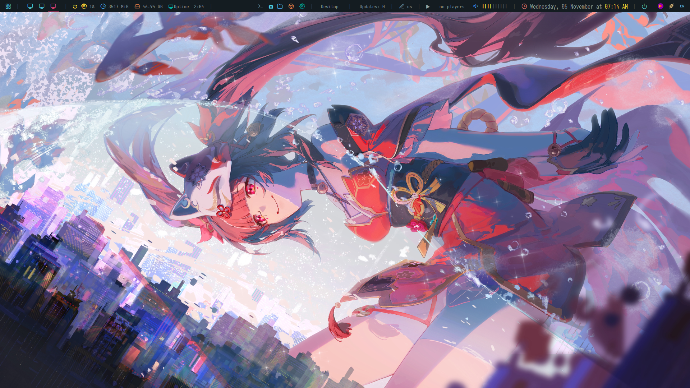

# i3 Ubuntu Configuration
Some Minor i3 customization with polybar !


Polybar-2:
# 


> **Note:**
> This is a personal setup. Use at your own risk — issues may require manual troubleshooting.

## Required Packages
Install with:

```bash
sudo apt install i3 rofi compton nitrogen polybar arandr playerctl dunst fonts-noto feh lxappearance xclip pulseaudio-utils network-manager network-manager-gnome flameshot git unclutter
```

### Package Overview
* **i3** – Window manager
* **Rofi** – Application launcher
* **Compton** – Compositor for transparency
* **Nitrogen / Feh** – Wallpaper manager
* **Polybar** – Custom status bar
* **Arandr** – Display configuration tool
* **Playerctl** – Media control for Polybar
* **Dunst** – Notifications
* **Fonts-Noto** – Clean, readable font
* **LXAppearance** – Change GTK themes and icons
* **Flameshot** – Screenshot tool
* **Unclutter** – Hides cursor when idle

## Configuration Overview
* **Polybar** replaces i3status for a customizable bar.
* **Nitrogen & Compton** autostart for wallpaper and compositing.
* **Rofi** is themed as the app launcher.
* **Arandr** helps with multi-monitor setups.
* **Dunst** handles notifications.
* **LXAppearance** manages GTK themes and icons.

## Installation Steps
1. **Update system:**

   ```bash
   sudo apt update && sudo apt upgrade
   ```

2. **Install packages:**

   ```bash
   sudo apt install i3 rofi compton nitrogen polybar arandr playerctl dunst fonts-noto feh lxappearance xclip pulseaudio-utils network-manager network-manager-gnome flameshot git unclutter
   ```

3. **Clone the repository:**

   ```bash
   git clone https://github.com/zionnewbie/i3-ubuntu.git
   ```

4. **Copy configurations:**

   ```bash
   cp -r i3-ubuntu/.config ~/
   ```

5. **Log out and select i3** from your login manager.


## Customization
* Edit `~/.config/i3/config` for keybindings and startup apps.
* Adjust Polybar in `~/.config/polybar/config`.
* Use **LXAppearance** for themes and icons.
* Set wallpapers with **Nitrogen** or **Feh**.
* Modify Rofi themes in `~/.config/rofi/`.


## Troubleshooting
* Check `~/.xsession-errors` for startup issues.
* Re-run **arandr** for display problems.
* Install missing fonts/icons if something looks off.
